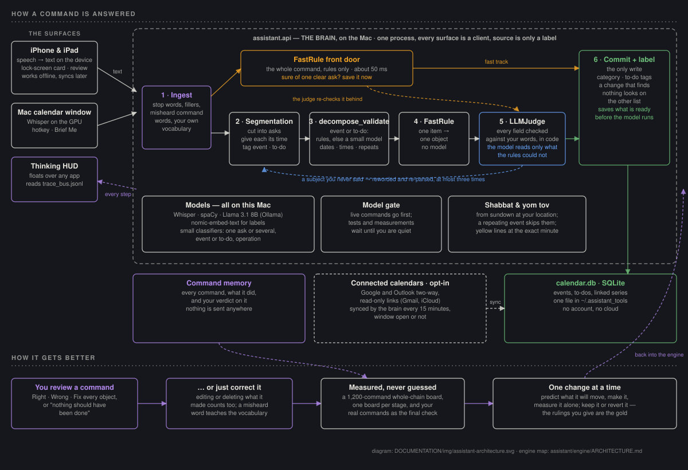

# MACalendar — a voice calendar that runs on your Mac

A privacy-focused, voice-driven calendar and to-do assistant. You speak to the Mac,
your iPhone or your iPad; one "brain" on the Mac understands the command and
updates the calendar. Speech recognition, language understanding and storage all
run locally — no account, no cloud service.

> [!IMPORTANT]
> The brain runs on **macOS** (Apple Silicon recommended). The iPhone and iPad
> apps are clients of it, reaching the Mac over a private Tailscale link.


## How the AI assistant works



> **The assistant improves itself.** An autonomous, hypothesis-driven loop
> measures the AI system against a 3,000-utterance ground truth, reads its own
> failures, predicts what one change will do, makes it, and verifies the
> prediction — every score, change and decision recorded. How it works:
> [DOCUMENTATION/SELF_IMPROVEMENT.md](DOCUMENTATION/SELF_IMPROVEMENT.md).

**Full feature catalog** — every feature, where it lives, and how it's built:
[DOCUMENTATION/FEATURES.md](DOCUMENTATION/FEATURES.md).

A spoken command becomes text on the device it was said to (Whisper on the Mac's
GPU; Apple's on-device recogniser on the phone) and goes to the brain, which runs
it through six stages — the **engine**:

1. **Ingest** repairs the words: the stop word, fillers and stutters, misheard
   command words, and your own vocabulary of names and places.
2. A **front door** (FastRule, rules only, about 50 ms) answers a single clear
   ask at once — "book the dentist tomorrow at 4pm" never waits for a model.
3. Anything else takes the **deep track**: **segmentation** cuts the command into
   separate asks and gives each its time; **decompose_validate** settles event or
   to-do (rules first, a small model only when no rule fired) and resolves dates,
   times and repeats; **FastRule** turns each item into one object, with no model.
4. **LLMJudge** checks every field against the words you said — in code; the
   local language model (Llama 3.1 8B on Ollama) is asked only to read what the
   rules could not build.
5. **Commit** is the only write. It labels the row (category, to-do tags), looks
   on the other list when a change finds nothing, and on a long command saves
   what is ready before the model reads the rest.

Every command is remembered with what it did; your reviews and corrections are
what the engine is measured against. The map of the engine:
[assistant/engine/ARCHITECTURE.md](assistant/engine/ARCHITECTURE.md); the system:
[DOCUMENTATION/SYSTEM.md](DOCUMENTATION/SYSTEM.md).

**Every command is checked, whichever path answered it.** A rule-path answer
is returned immediately and then reviewed in the background: deterministic code
checks each saved object's fields against the words actually said (the model is
not asked for a verdict — that call was retired on 2026-09-10 after it changed
no outcome). It reports rather than rewrites — measured over the corpus,
applying its corrections fixed nothing and broke one thing, so it advises and
the trace shows what it found.
What *does* correct itself is narrower and evidence-based: a change that finds
nothing on one list looks on the other, and a single command that still matches
nothing gets one second reading from the model before you hear "I couldn't find
that". A title that names nothing ("add this to my calendar") is refused out loud
rather than guessed.

### One brain, two surfaces

`assistant.api` parses and executes **everything**. The Mac GUI and the iPhone
are both clients of it — the GUI posts to `127.0.0.1:8080`, the phone posts over
Tailscale, and `source` (`"mac"` / `"ios"`) is the only difference between them.
They previously had separate implementations of the same pipeline, which drifted
until the same sentence produced different results depending on which microphone
heard it.

### Nothing leaves the machine

Whisper runs on the GPU from a cached model, the language and embedding models
are Ollama on `localhost`, spaCy and the date recogniser are local, the Hebrew
calendar is pure Python, and the database is a file in `~/.assistant_tools/`.
There is no account, no API key and no telemetry. `tests/unit/test_offline.py`
blocks every non-loopback socket and fails the build if that ever stops being
true. Two links are yours to open: the phone reaching the Mac over Tailscale,
and — only if you connect one — a Google or Outlook calendar (below).

### Seeing what it did — the thinking HUD

Every stage of that pipeline streams live to a small always-on-top card: what
it heard, which parse path answered, what it changed, and how long each step
took. Tap a misheard word to teach it; 👍/👎 feeds the command memory.

It is **its own application**, not part of the calendar window, because a
command given from your phone arrives while you are working in something else —
and the calendar app may not even be open. So it floats over whatever you are
actually in, never takes keyboard focus, and sits slightly translucent until
you hover it. Drag it by its header to move it; right-click for Hide / Reset
position / Quit.

It appears on the first command and then **updates in place** rather than
re-announcing itself, and closing it is an instruction it remembers — reopen
from the menu bar item. Commands that arrive while it is closed are still
recorded.

**History** lists every command it has ever run, newest first: when, from which
device, what you said and what it did. Click one to replay its full timeline.
Search matches both what you said and what it answered, and chips narrow by
device (Mac / iPhone), by kind (Events / Tasks), and to the ones that went wrong
(Failed). Scripted runs are tagged and hidden unless you ask for them.

`Launch Calendar.command` starts it. On its own: `python -m assistant.thinking_hud`.
Turn it off in **Settings › Assistant** (`ui.show_thinking`), or move it with
`ui.thinking_corner`.

### Repeating events

"go pray mincha-maariv every day at 1900 until Oct 6th" works, as do "every
tuesday and thursday at 9", "every friday at noon" and "daily standup at 9am
until December 1". In either app's event editor,
**Repeat** takes an **End repeat: Never / On date**, and every occurrence stays
linked as one series — change the end date and the whole series follows.

Worth knowing: **"until" stops before the day it names** — say "through Oct 6th"
or "including Oct 6th" to keep it (the editor's end date is inclusive). A series
repeats daily, weekly (on one or several weekdays), monthly or yearly; anything
else ("every other tuesday", "twice a week") is rounded to the nearest of those
and the reply says so. **Series skip Shabbat and yom tov**, bounded by candle
lighting and nightfall at your location — except meals, and a series you
deliberately put on Shabbat.

### Shabbat and yom tov on the calendar

The Day and Week views draw a **yellow line at the exact minute** Shabbat or yom
tov begins and ends, computed from sundown at the configured place — or at the
phone's location, if you turn on "Sundown follows this device" in the phone's
settings. Toggle the lines in Settings › Hebrew Calendar
(`hebrew_calendar.show_shabbat_times`).

### Connected calendars (Google, Outlook)

Settings › **Connected Calendars** on either app connects Google Calendar or
Outlook both ways, or subscribes to any calendar's read-only link (a Gmail
calendar's "secret iCal address", iCloud, Outlook.com). "How to connect, step by
step" walks each one inside the app; the one-time app registration with Google or
Microsoft is described in [DOCUMENTATION/CALENDAR_SYNC.md](DOCUMENTATION/CALENDAR_SYNC.md).
The Mac keeps them in step every 15 minutes (`calendar_sync.interval_minutes`),
whether or not the calendar window is open. Nothing is contacted until you
connect something.

### Was it right? — reviewing commands

Every voice command waits in **Review commands** (a banner once five are waiting;
always in Settings › Assistant) until you say whether it was right. **Fix…**
lists every object the command touched, each with Right / Change / take it back
(remove what it created, restore what it deleted, put back what it edited), a
one-tap **"Nothing should have been done"**, a way to add what it missed, and a
reason. Your answers are the gold the engine is scored against; nothing leaves
the Mac.

## Prerequisites

Before installation, ensure you have the following:

- **Hardware:** A Mac (Apple Silicon M-series recommended for best performance).
- **Python:** Version 3.11 or higher.
- **Microphone Access:** You will need to grant your Terminal or IDE permissions to access the microphone.
- **Ollama:** Download and install [Ollama](https://ollama.ai).
  - After installing Ollama, pull the reasoning model: `ollama pull llama3.1:8b` (or your preferred model according to `config.yaml`).

## Installation

1. **Clone the project:**
   ```bash
   git clone <repository-url>
   cd MACalendar
   ```

2. **Set up a Virtual Environment:**
   ```bash
   python3.11 -m venv .venv
   source .venv/bin/activate
   ```

3. **Install Dependencies:**
   ```bash
   pip install --upgrade pip
   pip install -e .
   ```

## Configuration

The application uses `config.yaml` for customization. If it doesn't exist, you can create it from the example:
```bash
cp config.example.yaml config.yaml
```

### Key Settings:
- **`llm_engine`**: Choose your reasoning brain:
  - `"ollama"` (Default): Free, local, private. Requires Ollama to be running.
  - `"openai"`: High performance. Requires `openai.api_key`.
  - `"gemini"`: Google's LLM. Requires `gemini.api_key`.
  - `"claude"`: Anthropic's LLM. Requires `claude.api_key`.
- **`hotkey`**: The trigger for the voice listener (default is `Cmd+Shift+Space`).
- **`tts`**: 
  - `voice`: Preferred system voice (e.g., `"Ava"`, `"Zari"`, `"Samantha"`). Run `say -v \?` in your terminal to see all options.
  - `rate`: Talking speed.
  - `mute`: Set to `true` for a silent assistant.
- **`ui.start_view`**: which view the calendar opens on — `month | week | day | agenda`,
  `week` by default. The phone has its own choice in Settings › Appearance.
- **`ui.show_thinking`** / **`ui.thinking_corner`**: whether the thinking HUD appears,
  and which screen corner it parks in until you drag it somewhere else.
- **`todo.auto_tag`** / **`todo.auto_tag_infer`**: `auto_tag` is "tag mode" — every new
  task gets that one tag. With it empty, a tag is inferred from the title instead
  ("buy chicken" → Groceries), and only tags that already exist are ever used.
- **`api.port`**: where the API listens (default `8080`). Both the phone **and the
  Mac GUI** post commands there, and the HUD uses it too.
- **`verify_fast_path`** / **`self_check_apply`**: the background review of a
  fast answer. The first is on — every fast-track command is checked against your
  words behind the answer and the finding shown in the trace. The second is off,
  and the comment beside it in `config.yaml` carries the measurement: applying
  those corrections fixed 0 commands and broke 1.
- **`calendar_sync`** / **`google_calendar`** / **`microsoft`**: connected calendars
  (see above); nothing runs until a source is connected.
- **`hebrew_calendar`** / **`observance`**: the Hebrew-date display, holidays, the
  yellow Shabbat lines, and the place sundown is computed for.
- **`confirmation_level`**: **no longer has any effect.** The dialog belonged
  between parse and execute, and both now happen in the API process, which has no
  screen. The GUI warns at startup if you have it set above 0.

## Usage

### Starting the App
- **The easy way:** Double-click `Launch Calendar.command` in the Finder. It starts
  everything: Ollama (if it isn't already up), the API server, the thinking HUD,
  and the calendar window. Closing the calendar window stops the rest.
- **The terminal way:** the API first, because the calendar window is a client of
  it and will say so if it is missing —
  ```bash
  python -m assistant.api --tailscale --reload  # THE BRAIN — start this first
  python -m assistant.main                      # the calendar window
  python -m assistant.thinking_hud              # the always-on-top trace card
  ```
  `--reload` restarts the API when anything under `assistant/` changes, so editing
  the assistant does not mean relaunching everything. **The GUI and the HUD do not
  reload** — restart those by hand.

  They share no memory: the calendar DB is the source of truth, and traces travel
  between them through `~/.assistant_tools/trace_bus.jsonl`.

### Views
- **Month / Week / Day / Agenda** — switch with the toolbar buttons. The calendar
  opens on **Week** unless you change "Open calendar on" in Settings › Appearance.
- The **Day view** shows a full hourly timeline for any single date with a live red current-time indicator.
- **Tasks** — Apple Reminders-style task panel with Today and General lists (see below).

### Morning Briefing
Click the **Brief Me** button in the Day view (or ask via voice) to have your assistant read today's full schedule aloud — great for hands-free mornings.

Voice triggers: *"What does my day look like?"*, *"When is my first meeting?"*, *"What's next?"*, *"How many events do I have today?"*

### Tasks View
Switch to **Tasks** in the toolbar to manage your todo list with two sections:

| Section | Purpose |
|---------|---------|
| **Today** | Tasks for today. Click **Sync Today** to pull in today's calendar events automatically. |
| **General** | Ongoing or someday tasks, independent of any date. |

**Manual editing:** Click any task title to edit it inline. Click the checkbox to complete it. Hover to reveal the × delete button. Click **+ New Task** to add from the keyboard.

**Calendar sync:** The **Sync Today** button in the Today header pulls all of today's calendar events into your Today list as tasks. The gear icon offers additional sync options (upcoming week → General list, or clear synced tasks).

**Tags:** every task can carry tags (Coursework, Groceries, Errands, Work, Personal,
plus any you add). Filter by them with the chips above the list. A task created
without one gets a tag inferred from its title — *"buy chicken"* → Groceries — and
nothing at all when it isn't sure, since a wrong tag has to be undone by hand.
Turn that off with `todo.auto_tag_infer`, or force one tag onto everything new with
"tag mode" (`todo.auto_tag`).

**Voice commands (Tasks mode):**
When the Tasks tab is active, the mic button enters *Tasks mode* — voice commands are automatically biased towards task actions:
- *"Add task buy groceries"* — adds a single task
- *"Add tasks: buy milk, call dentist, walk the dog"* — adds multiple tasks at once
- *"Buy chicken and rice"* — **one task per item**, sharing the verb: *buy chicken* and
  *buy rice*, both tagged Groceries. Same for *"call mom and dad"*. An "and" that
  belongs to one errand is left alone, so *"buy a gift for mom and dad"* stays a
  single task, and so does *"fish and chips"*.
- *"Mark buy milk done"* / *"Check off call dentist"* — complete a task
- *"Delete buy groceries"* / *"Remove it"* — delete by title or by anaphoric "it"
- *"Rename buy milk to buy oat milk"* — update a task
- *"Move call dentist to general list"* — change list
- *"Put milk and bananas on the groceries list"* — tag as you add
- *"What tasks do I have today?"* — read out the list (switches to Tasks view)

> [!TIP]
> **Context Memory:** Within the Tasks view, "it" and "that task" always refer to the last task you created or modified.

### Interacting with Voice
1. **Trigger:** Press the hotkey (`Cmd+Shift+Space`) to start listening.
2. **Speak:** State your request clearly (e.g., *"Schedule a dentist appointment for tomorrow at 2 PM"* or *"Cancel my meeting with Alex"*).
3. **Finish:** Say **"execute"**, **"done"**, or simply press the hotkey again to trigger the actions immediately.
   ("done" that belongs to the command — "mark the rent as done" — is kept.)
4. **Say a day and a time for events.** A stated clock makes an event; no clock
   makes a to-do due that day; meeting or calling a person is an event (9:00 when
   no time is said). The in-app **How to talk to me** tips show the rest.

> [!TIP]
> **Context Memory:** You can refer to the last event you created by saying "delete **it**" or "move **that event**". Same works for tasks.

## Security & Privacy
- **LLM Choices:** By default, everything is local and private using Ollama. If you switch to `openai`, `gemini`, or `claude`, your transcripts will be sent to the respective provider's API.
- **Full Local Logic:** Audio is transcribed locally — Whisper (MLX on the Apple GPU, or `faster-whisper`) on the Mac, Apple's on-device recogniser on the phone.
- **Connected calendars are opt-in:** only a Google or Outlook account you connect is contacted, and its sign-in tokens stay on the Mac.
- **Prompt Injection Defense:** Basic sanitization prevents malicious commands from being executed via voice.
- **Persistence:** closing the application will save all your changes to the `.db` file normally.

## Testing
Use the project's virtual environment — a bare `python` may lack the models'
dependencies and report phantom failures:
```bash
./.venv/bin/python -m pytest tests/unit          # fast, no model needed (what CI runs)
./.venv/bin/python -m pytest tests/integration   # needs Ollama; skips without it
```

Don't judge a change to the assistant by trying a couple of phrasings. Each
stage of the engine has its own board, and the whole chain has one — every
change is measured alone, on a split it was not tuned on, before it is kept:

```bash
python -m assistant.engine.fastrule.experiments.fastrule_shape --split train   # the front door, seconds
python -m assistant.engine.segmentation.experiments.run_board                 # segmentation
python -m assistant.engine.llmjudge.experiments.board_d -n 1200               # the whole chain, seeded (~50 min, uses the model)
python -m scripts.real_usage_board                                            # your own commands — the final check
```

How the loop works, and the rules it keeps (one change at a time, the sealed
test split, every number with its dataset and n): [CLAUDE.md](CLAUDE.md),
[dataset/DATASET.md](dataset/DATASET.md), [dataset/METRICS.md](dataset/METRICS.md).
The older hand-written audit (`scripts/audit_assistant.py`) is kept as a
regression floor.

## iPhone & iPad App

A native SwiftUI app (iPhone and iPad) talks to the Mac's API, which stays the
source of truth. It keeps a full local copy and a queue, so it works with the Mac
away and syncs when it is back. Beyond the calendar and tasks it has: voice with
a live "thinking" timeline, the **Up Next** lock-screen card (two events at a
time, a Today and a General to-do page with a tick button; tap it to open the
right tab), Review commands, Connected Calendars, the Shabbat lines, and the
in-app tips.

### 1. Deploy the App (via Xcode)
1. Open `MACalendar-iOS/MACalendar-iOS.xcodeproj` in **Xcode**.
2. Set your **Signing Team** in *Signing & Capabilities*.
3. Connect your iPhone or iPad and click **Run**.
4. (First time) Go to **Settings → General → VPN & Device Management** and **Trust** your developer profile.

With a free Apple ID the app must be reinstalled every 7 days; a paid developer
account lasts a year.

### 2. Connect via Tailscale (Recommended)
Tailscale provides a secure, private tunnel between your Mac and iPhone without port forwarding.
1. **Mac:** `brew install tailscale` → Sign in.
2. **iPhone / iPad:** Install [Tailscale](https://apps.apple.com/app/tailscale/id1470499037) → sign in with the **same account** as the Mac.
3. **Start API:** `python -m assistant.api --tailscale` (Prints your 100.x.x.x IP).
4. **App Settings:** Set Server URL to `http://<your-tailscale-ip>:8080`.

For full deployment details and API reference, see [**SYSTEM_IPHONE.md**](DOCUMENTATION/SYSTEM_IPHONE.md).

### API endpoints (quick reference)

| Method | Path | Purpose |
|--------|------|---------|
| GET | `/health` | Server status |
| GET | `/events?date=YYYY-MM-DD` | Events for a day |
| POST | `/events` | Create event |
| POST | `/voice/text` | Voice command as text |
| GET | `/todos` | Todo list |
| PATCH | `/todos/<id>/toggle` | Complete a task |

Full API reference: [DOCUMENTATION/API_REFERENCE.md](DOCUMENTATION/API_REFERENCE.md) (generated from the server code)

---

## For Developers & AI Assistants

Start with **[STATUS.md](STATUS.md)** (where things stand) and
**[CLAUDE.md](CLAUDE.md)** for the workflow — how to keep tests out of your real
vocabulary and command memory, how to measure a change to the assistant, and the
things that have bitten before. Then the engine map,
**[assistant/engine/ARCHITECTURE.md](assistant/engine/ARCHITECTURE.md)**, and the
system, **[SYSTEM.md](DOCUMENTATION/SYSTEM.md)**. Every feature, where it lives and
how it is built: **[FEATURES.md](DOCUMENTATION/FEATURES.md)**; the plan:
**[TASKS.md](DOCUMENTATION/TASKS.md)**; decisions already made:
**[DEVQA.md](DEVQA.md)**.

### How big is it?

**[DOCUMENTATION/CODE_SIZE.md](DOCUMENTATION/CODE_SIZE.md)** — lines and files
per part of the system: engine, Mac app, iOS app, review panel, model code,
microphone, tests, and the boards that measure it all.

That file is generated, and no count is repeated here, because a number typed
into a README is wrong by the following week:

```bash
python -m scripts.code_stats --install-hook   # refresh it on every commit
python -m scripts.code_stats                  # print it
python -m scripts.code_stats --write          # regenerate by hand
python -m scripts.code_stats --check          # is it current?
```

Install the hook once and the numbers look after themselves: it rewrites the
breakdown from the staged index before each commit, so the figure always
describes the commit it ships in, and it stages nothing when the counts have
not moved. It never blocks a commit. `tests/unit/test_code_size.py` is the
backstop for a checkout without the hook — red once the written figure is more
than 2% out.
